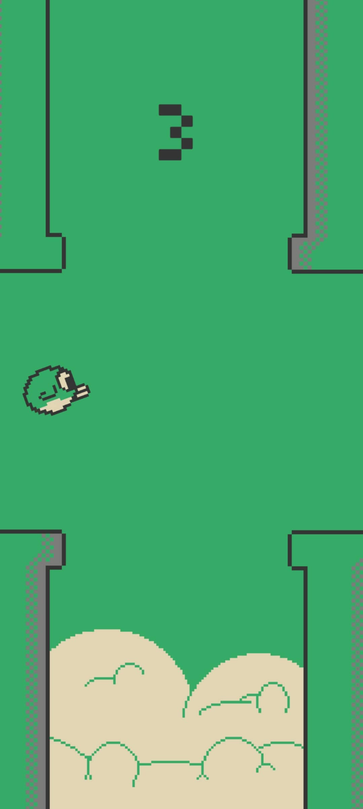

# 🐦 Flappy Bird Clone (Beginner Project)

This is a simple **Flappy Bird–style arcade game** built as part of my game development learning journey.  
It focuses on core mechanics like input handling, gravity physics, collision detection, and scoring.  

---

## 🎮 Features
- Tap/click to flap (basic input)
- Gravity + jump physics
- Randomly spawning pipes/obstacles
- Score counter & restart button
- Clean and minimal UI

---

## 🖼️ Screenshots

| Gameplay | Game Over Screen |
|----------|------------------|
|  |  |


---

## 🚀 How to Play
1. Clone this repo  
   ```bash
   git clone https://github.com/KyecasEntertainment/FlappyClone-Fly-High-.git
   ```
   Open in **Unity (or your chosen engine)** and press **Play**.  

2. **Or** download the prebuilt executable:  
   👉 [Download `.exe` here](https://github.com/KyecasEntertainment/FlappyClone-Fly-High-/releases)  

---

## 🛠️ Built With
- **Unity** (C#) – Game engine
- **Aseprite** - Pixel Art  

---

## 📜 License
This project is licensed under the **MIT License** – see the [LICENSE](LICENSE) file for details.  

⚠️ **Disclaimer:** This is an educational project inspired by *Flappy Bird*.  
All code is original, and all assets are placeholders or custom-made.  
This project is **not affiliated with or endorsed by the original creators of Flappy Bird**.  

---

## 🌟 Future Plans
- Sound Effects for UI and Gameplay
- Add different themes (night/day mode)  
- Leaderboard system  

