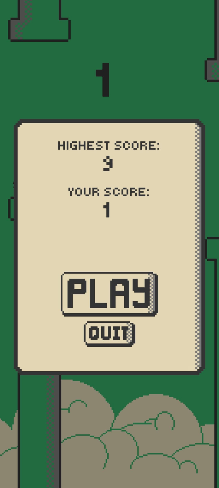

# 🐦 Flappy Bird Clone (Beginner Project)

This is a simple **Flappy Bird–style arcade game** built as part of my game development learning journey.  
It focuses on core mechanics like input handling, gravity physics, collision detection, and scoring.  

---

## 🎮 Features
- Tap/click to flap (basic input)
- Gravity + jump physics
- Randomly spawning pipes/obstacles
- Score counter & restart button
- Clean and minimal UI

---

## 🖼️ Screenshots

| Gameplay | Game Over Screen |
|----------|------------------|
|  |  |

*(Replace `images/gameplay.png` and `images/gameover.png` with your own image paths in the repo.)*

---

## 🚀 How to Play
1. Clone this repo  
   ```bash
   git clone 
